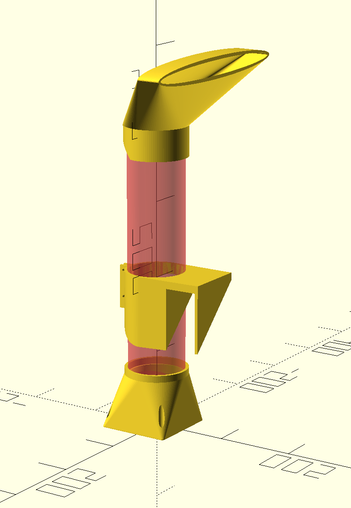

# Bed Cooler

This is a test prototype of a home made bed cooler, that blows cold air at your feet when they get too hot. I don't know if it'll work.

The STL files expect a MALM bed from Ikea and a 75mm OD PVC pipe, cut to an appropriate length.
